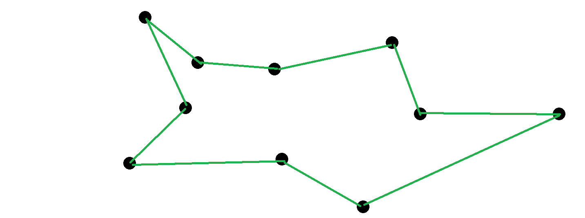
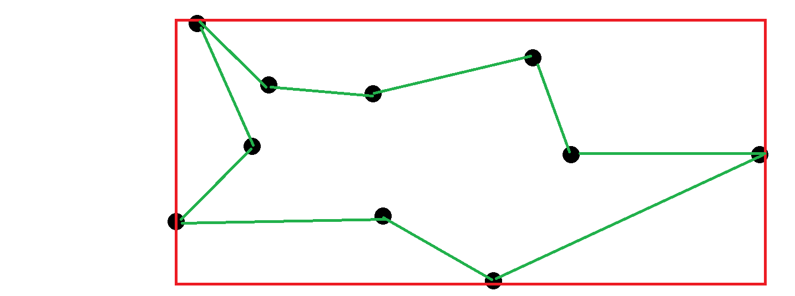

# Data Engineer Test

## Read before starting

The following test aims at helping you to show us your qualities as a Data Engineer. 
You are expected to be able to code, interact with data from an external API and create an industrialized data pipeline. As a Data Engineer we also expect you to have great skills as a developer ;)

* What we **do expect** from you: 
    - Show us your best skills. Answer every question.
    - Explaining how, what and why you do something is as important as coding. Diagrams and schemas will weight as much as functions and methods.
    - If you arrived here, you know about *craftsmanship* ;) do not forget it when coding.

* What we **do not** expect:
    - That you spend too much time doing this test, it's desinged to be finished in less than 4 hours (ich). You can spend more or less time, (if you add time, keep it reasonable).
    - You spend an awful moment taking the test ;).

* What's **a bonus**:
    - Your code is tested with a high coverage (>80%).
    - The application you wrote works properly.
    - The explanation of the architecture/technology is not only answered but also highly detailed for each expected point: 
        * SPOFs (if any)
        * Future problems
        * Budget
        * Maintenance
        * Technical debt
        * DevOps tecnhiques.
        * ...
    - Even if you show your knowledge with other technologies, your solution can be deployed to Google Cloud Platform.
 
## Context

A new international partner in IoT gives us the measures of temperatures coming from their sensors. 
We can access their measures using the following (dummy) API. 
 
``` 
curl -H "X-API-Key: dd764f40" https://my.api.mockaroo.com/sensor/temperatures
``` 
 
This Rest API will send you back a json with the following schema:

```
[
  {
    "id": "1b16b092-e8e8-490b-a9be-0db1580fb164", // An unique id 
    "timestamp": "2019-02-19 14:02:10", // the timestamp at which the record was taken
    "lat": 45.6258385, // latitude
    "lon": 0.0629891, // longitude
    "temperature": 29.4068, // the temperature value
    "country": "France" // the country
  }
]
```
 
Every record contains the temperature at the moment you call the API. If you call the API twice you will then get different results.
 
***Our objective is to find out the mean temperature for every region in France. We are only interested in points in France, not elsewhere.*** 
 
The following link provides the coordinates of the frontier for each region.
 
```
https://datanova.laposte.fr/explore/dataset/contours-geographiques-des-nouvelles-regions-metropole/table/ 
```

A measured temperature is in a region if it's inside of the polygon defined by the data above. As the algorithm for defining whether a point is within a shape or not might be quite hard to code, we assume that all regions are rectangles. Have a look at the following section for more details.

Once you aggregate the data, you must send the results to a test MySQL database. We will provide you with the credentials and info.
 
**We expect to find at least one table in this database that satisfies the following schema:**
 
 * hour (the time at the import was started)
 * region
 * temperature
 * numberOfPoints (the number of points used to compute the mean temperature)

#### Region definition

The preceeding link provides us with a list of cities with their associated region. However, to perform the matching, we need to get the GPS coordinates of every region. The GPS coordinates are in the dataset, but in order to ease the test, we are going to assume that regions are rectangles. Even though this does not make any sense in the real world, this is a shortcut to make your life easier ;)

If we call `E` the list of GPS points for a region boundary, then we define the bounding box for the region as : 
``` 
R = ( { min(latitude) in E, min(longitude) in E } ; { max(latitude) in E, max(longitude) in E } )
```

For instance, if for a given region, we get the following list of GPS coordinates:



Then we define the associated region as:



Using this (dumb) assumption, one point could end up in multiple regions, as there will be overlap in the rectangles. In this case, just take the first rectangle that matches.

## SQL
 
Once we get all your data set up, *we would like you to write a SQL query that gives us the following information: for every region and every hour, we want the temperature at this hour and also the temperature 3 hours before.*
 
The dataset should then look like :
 
| Region  | Hour  | Temperature  | Temperature3HoursBefore  |
|---|---|---|---|
| ...  | ...  | ...  |  ... |

## Bonus

To ease the test, we defined regions as rectangles using their bounding box. If you still have time, it would be great to use the real definitions of the regions, and therefore use the polygons defined in the dataset.

## Architecture plan. 

Now you should write a plan explaining the following points. The goal here is not to code anything but rather explain your ideal solution:

* *If you were to develop the same application where the temperatures dataset grows by 1Go per minute, what would you do differently?* 

* *If our data source was to emit multiple versions (corrections for instance) of the same data, what could be the different applicable strategies?*

* *What infrastructure, products, workflow scheduler, would you use to make sure the whole pipeline runs fine in production?*

* *Some months later, we think to apply another aggregation/model to the input data. How would your architecture evolve to integrate this challenge?*


# Key Points
 
The key points we will be looking at are:
* Architecture and design.
* Code quality.
* Test
* Tech choices.
* Scalability
* Error Handling
* Backup
* Continuous integration
* Versioning
